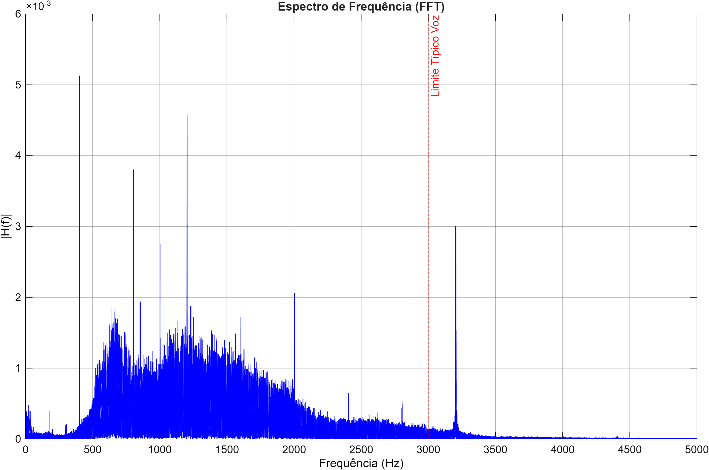
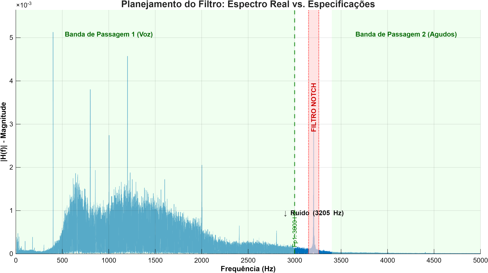
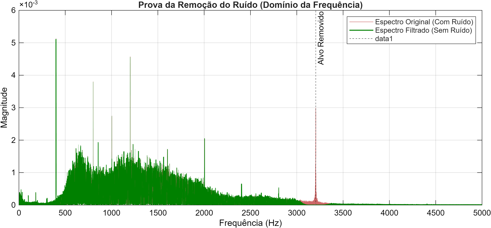
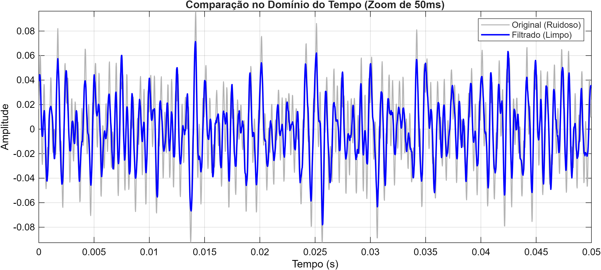

# PDS - Atividade Prática 3: Projeto de Filtros Digitais

  

Este projeto aplica conceitos de Processamento Digital de Sinais para restaurar a inteligibilidade de comunicações históricas da missão Apollo 11, removendo tons de interferência ("Quindar Tones") através de filtros digitais projetados via janelamento.

## 🎯 Objetivo
Identificar, diagnosticar e especificar tecnicamente um filtro digital para remover ruídos de banda estreita em gravações de voz reais, preservando as características históricas do sinal e a inteligibilidade da fala.

---

## 🚀 Como Executar o Projeto

Para reproduzir os resultados e gerar os gráficos, siga os passos abaixo:

1.  Abra o **MATLAB**.
2.  Navegue até a pasta `src/` deste repositório.
3.  Digite o comando abaixo no Console e pressione Enter:
    ```matlab
    main
    ```
4.  Utilize o menu interativo para navegar entre as etapas (Análise, Projeto e Aplicação) ou escolha a opção **9** para rodar o pipeline completo.

> **Nota:** Os resultados (gráficos) serão salvos automaticamente na pasta `results/` e o áudio limpo em `assets/processed/`.

---

## 🔊 Fonte de Dados (Dataset)

Para esta prática, utilizou-se um áudio histórico real contendo ruídos característicos de transmissão.

* **Fonte Original:** [Apollo 11 Onboard Audio - Archive.org](https://archive.org/details/Apollo11Audio/Apollo11OnboardAudioHighlightClip2.mp3)
* **Processamento Inicial:** Recorte manual (Audacity) de um trecho de ~1m30s contendo fala e ruído de fundo.
* **Padronização:** A taxa de amostragem nativa foi preservada ($F_s = 44100 \text{ Hz}$).

---

## ✅ Roadmap de Desenvolvimento

### Parte 1: Análise e Diagnóstico
- [x] Carregar áudio e converter para mono.
- [x] Plotar sinal no Tempo e Frequência.
- [x] Diagnosticar a frequência exata do ruído ($3205 \text{ Hz}$).

### Parte 2: Projeto do Filtro
- [x] Definir especificações (Tabela de Projeto).
- [x] Escolher topologia (FIR Notch) e Método (Janela de Kaiser).
- [x] Calcular coeficientes e validar ordem ($N=704$).

### Parte 3: Aplicação e Avaliação
- [x] Aplicar filtragem de fase zero (`filtfilt`).
- [x] Gerar áudio limpo (`nasa_limpo.wav`).
- [x] Comparar espectros e formas de onda (Antes x Depois).

---

## 📄 Relatório Técnico e Resultados

### 1. Análise do Sinal (Diagnóstico)

A análise espectral revelou que a voz humana está concentrada abaixo de 3 kHz. Foi identificado um **pico tonal isolado** em **3205 Hz**, caracterizando um ruído de banda estreita (Narrowband Noise).



### 2. Decisões de Projeto

#### **Discussões mais aprofundadas no Relatorio.pdf neste diretorio GitHub**

Para remover o ruído sem abafar a voz, optou-se por um filtro **Rejeita-Faixa (Notch)**. Um filtro Passa-Baixa foi descartado pois eliminaria os harmônicos superiores da voz (> 3400 Hz), prejudicando a fidelidade histórica.

**Especificações Técnicas:**

| Parâmetro | Valor | Descrição |
| :--- | :--- | :--- |
| **Freq. de Amostragem ($F_s$)** | $44100 \text{ Hz}$ | Taxa nativa do áudio. |
| **Alvo do Ruído ($F_c$)** | $\approx 3205 \text{ Hz}$ | Frequência central a ser removida. |
| **Banda de Passagem 1** | $0 - 3000 \text{ Hz}$ | Faixa onde a voz é preservada. |
| **Banda de Rejeição** | $3150 - 3260 \text{ Hz}$ | "Zona morta" de supressão total. |
| **Banda de Passagem 2** | $> 3400 \text{ Hz}$ | Faixa de preservação dos agudos. |
| **Ripple ($R_p$)** | $0.01$ ($1\%$) | Variação máxima permitida no ganho. |
| **Atenuação Mínima ($A_s$)** | $\ge 40 \text{ dB}$ | Redução do ruído para inaudibilidade. |

**Planejamento Visual (Overlay):**
A máscara abaixo ilustra as zonas de passagem (verde) e corte (vermelho) sobre o espectro real.



### 3. Resultados Obtidos

O filtro FIR projetado (Ordem 704) foi aplicado ao sinal. A comparação espectral comprova a remoção cirúrgica do tom de 3205 Hz, mantendo a integridade das frequências de voz adjacentes.

**Comparação Espectral (Antes vs. Depois):**


**Comparação Temporal (Zoom 50ms):**


---

## 🗂️ Estrutura de Pastas

```text

├── assets/
│   └── processed/
│       ├── nasa_cut.wav            # Áudio original cortado
│       ├── nasa_limpo.wav          # Áudio filtrado (Resultado Final)
│       └── coeficientes_filtro.mat # Dados matemáticos do filtro projetado
├── docs/
│   ├── imagens/                    # Recursos visuais extras
│   ├── Atividade_Prática_3.pdf     # Roteiro original
│   └── Aula_PROJETO_filtros.pdf    # Material de apoio
├── results/                        # Gráficos gerados automaticamente
│   ├── grafico_1_tempo.png
│   ├── grafico_2_espectro.png
│   ├── grafico_3_planejamento_overlay.png
│   ├── grafico_4_tempo_comparacao.png
│   └── grafico_5_espectro_comparacao.png
├── src/
│   ├── main.m                      # <--- ARQUIVO PRINCIPAL 
│   ├── parte1_analise.m            # Script de Diagnóstico
│   ├── parte2_projeto.m            # Script de Cálculo do Filtro
│   ├── parte3_aplicacao.m          # Script de Filtragem e Validação
│   └── gerar_grafico_overlay.m     # Script auxiliar de visualização
├── README.MD                       # Documentação Git
└── Relatorio.pdf                   # Documentação 

```
