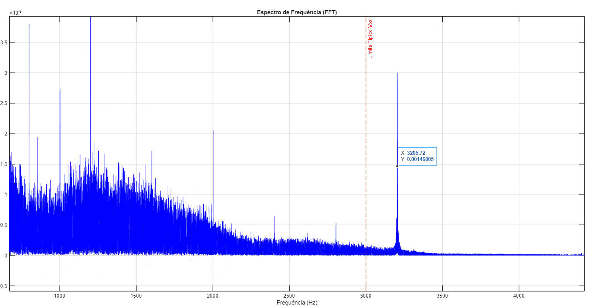
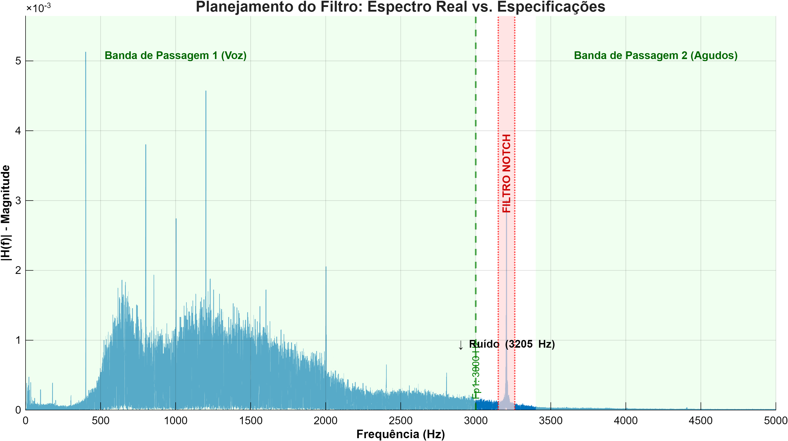

# Relatório: Análise e Projeto de Filtragem (Parte 1)

## 1. Metodologia de Aquisição de Dados

### 1.1 Pré-Processamento
Para viabilizar a análise computacional e focar em trechos de interesse (fala + ruído):
1.  **Recorte Temporal:** Utilizando o software *Audacity*, foi extraído um trecho de aproximadamente **1:30 min** (entre os minutos 07:00 e 09:00 do original).
2.  **Conversão:** O áudio foi convertido para canal mono no MATLAB para simplificar a análise espectral (média dos canais estéreo).
3.  **Padronização:** A taxa de amostragem nativa do arquivo foi preservada ($F_s = 44100 \text{ Hz}$), respeitando o padrão de áudio digital (Qualidade de CD) e garantindo a fidelidade na análise espectral.

---

## 2. Análise e Diagnóstico do Sinal

A análise foi conduzida em dois domínios para identificar a natureza da contaminação do sinal.

### 2.1 Análise no Domínio do Tempo
Observou-se visualmente a forma de onda. Mesmo nos momentos de silêncio (pausa na fala dos astronautas), a amplitude do sinal não é zero, indicando um *noise floor* (piso de ruído) elevado, característico de gravações em fita magnética e transmissão via rádio.

### 2.2 Análise no Domínio da Frequência (FFT)
Foi aplicada a Transformada Rápida de Fourier (FFT) para visualizar a distribuição de energia do sinal.

**Observações Fundamentais:**
1.  **Sinal de Voz:** A maior parte da energia da voz humana concentrou-se abaixo de **3000 Hz** (região azul densa no gráfico).
2.  **Identificação do Ruído:** Ao inspecionar a banda acima da voz (High Frequency), foi detectado um **pico tonal isolado** (Narrowband noise). Diferente de um chiado (que seria espalhado), este ruído se comporta como uma "agulha" no espectro.

#### Evidência 1: Log de Diagnóstico Automático
*Abaixo apresenta-se a saída do console do MATLAB durante a execução do script de análise, confirmando os parâmetros do arquivo e a detecção preliminar:*

```text
Carregando arquivo: ../assets/processed/nasa_cut.wav ...
Aviso: Áudio estéreo convertido para mono.
Áudio carregado com sucesso!
Duração Total: 89.47 segundos
Amostras: 3945710

[ANÁLISE TEMPORAL]
Observe a figura 1. Identifique visualmente onde há fala e onde há silêncio.

[ANÁLISE ESPECTRAL]
Observe a figura 2. O código abaixo tenta identificar picos automaticamente...

--- DIAGNÓSTICO AUTOMÁTICO ---
Pico de maior energia detectado em: 400.56 Hz
-> PICO NA FAIXA DE VOZ OU INCERTO.
   Verifique visualmente o gráfico para decidir.
------------------------------
````

#### Evidência 2: Espectrograma e Cursor de Dados

*A captura de tela abaixo demonstra a identificação precisa da frequência do ruído utilizando a ferramenta Data Cursor do MATLAB:*

.

> **Análise da Imagem:** O cursor aponta para um pico de magnitude elevada em **3205.72 Hz**. Note que esta frequência está isolada e acima do limite típico da voz (linha tracejada vermelha), confirmando ser um ruído de interferência ou tom de transmissão.

-----

## 3\. Decisões de Projeto

Com base no diagnóstico acima, as seguintes decisões de engenharia foram tomadas para a **Parte 2 (Projeto do Filtro)**:

### 3.1 Escolha da Topologia: Filtro Rejeita-Faixa (Notch)

Inicialmente, considerou-se um filtro Passa-Baixa (Low-Pass). No entanto, essa abordagem foi descartada.

  * **Justificativa:** Um filtro Passa-Baixa cortando em 3000 Hz eliminaria o ruído, mas também eliminaria os harmônicos superiores da voz e a "ambiência" da gravação, deixando o som abafado.
  * **Decisão:** Como o ruído é um tom puro em **3205 Hz**, a melhor estratégia é um filtro **Notch (Rejeita-Faixa)**. Ele atua "cirurgicamente", removendo apenas a frequência do bipe e preservando as frequências vizinhas (acima e abaixo).

### 3.2 Especificações Numéricas Definidas

Para garantir a remoção eficaz do ruído sem distorção perceptível, foram definidos os seguintes parâmetros rigorosos de projeto:

| Parâmetro | Valor | Descrição Resumida |
| :--- | :--- | :--- |
| **Freq. de Amostragem ($F_s$)** | $44100 \text{ Hz}$ | Taxa nativa do áudio. |
| **Alvo do Ruído ($F_c$)** | $\approx 3205 \text{ Hz}$ | Frequência central a ser removida. |
| **Banda de Passagem 1** | $0 - 3000 \text{ Hz}$ | Faixa onde a voz é preservada. |
| **Banda de Rejeição ($F_{stop}$)** | $3150 - 3260 \text{ Hz}$ | Zona de supressão total. |
| **Banda de Passagem 2** | $> 3400 \text{ Hz}$ | Faixa de preservação dos agudos. |
| **Largura de Transição ($\Delta f$)** | $150 \text{ Hz}$ | Faixa de decaimento do filtro. |
| **Ripple na Passagem ($R_p$)** | $0.01$ ($1\%$) | Variação máxima de ganho permitida. |
| **Atenuação Mínima ($A_s$)** | $\ge 40 \text{ dB}$ | Redução mínima do ruído. |

#### Justificativa Técnica das Decisões:

1.  **$F_s$ (44100 Hz):** Optou-se por não realizar *downsampling* para evitar processamento desnecessário e possíveis perdas de fidelidade nos agudos, mantendo a integridade do arquivo original.
2.  **Bandas de Passagem ($0-3000$ e $>3400$):** A voz humana possui inteligibilidade concentrada até 3kHz, mas componentes de "brilho" e sons ambientes existem acima disso. Cortar apenas o trecho do ruído preserva a naturalidade da gravação histórica.
3.  **Banda de Rejeição ($3150-3260$):** Estabeleceu-se uma margem de segurança de aproximadamente $\pm 50 \text{ Hz}$ em torno do pico de 3205 Hz. Isso garante que, mesmo se houver pequenas oscilações na frequência do transmissor da NASA, o ruído continuará sendo removido.
4.  **Largura de Transição ($150 \text{ Hz}$):** Uma transição muito abrupta (ex: 10 Hz) exigiria um filtro de ordem excessivamente alta (milhares de coeficientes), causando alto custo computacional e atraso (delay). $150 \text{ Hz}$ é um compromisso ideal entre seletividade e eficiência.
5.  **Ripple ($1\%$):** Um ripple de 0.01 corresponde a variações de amplitude inaudíveis para o ouvido humano, garantindo que a voz não sofra coloração ou distorção harmônica na banda passante.
6.  **Atenuação ($40 \text{ dB}$):** Uma atenuação de 40 dB corresponde a reduzir a amplitude do ruído em 100 vezes. Isso é suficiente para empurrar o tom interferente para baixo do *noise floor* natural da fita, tornando-o virtualmente inaudível.

.

### 3.3 Tipo de Filtro e Método

Optou-se pela implementação de um filtro **FIR (Finite Impulse Response)**.

  * **Método de Projeto:** Janelamento de Kaiser (Kaiser Window).
  * **Justificativa Técnica:**
    1.  **Fase Linear:** Filtros FIR garantem atraso de grupo constante, evitando que diferentes frequências da voz cheguem "desalinhadas" ao ouvido (distorção de fase).
    2.  **Controle de Ripple:** O uso da janela de Kaiser permite ajuste fino entre a ordem do filtro ($N$) e a atenuação dos lóbulos laterais, ideal para cumprir os requisitos de $A_s \ge 40 \text{ dB}$.

-----

## 4\. Conclusão da Fase 1

A etapa de análise foi concluída com sucesso. A utilização de um sinal real permitiu exercitar a identificação visual de artefatos no espectro. O ruído alvo foi isolado com precisão em **3205.72 Hz**, permitindo a especificação completa de um filtro seletivo que promete alta eficácia na remoção do ruído com mínima degradação do sinal de voz histórico.

```
```